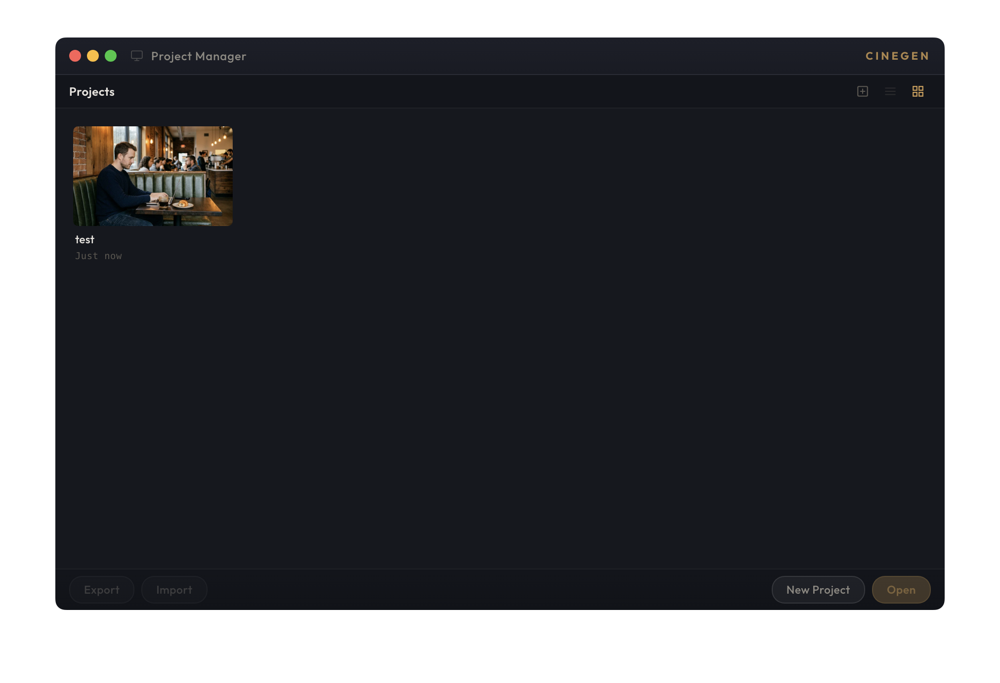
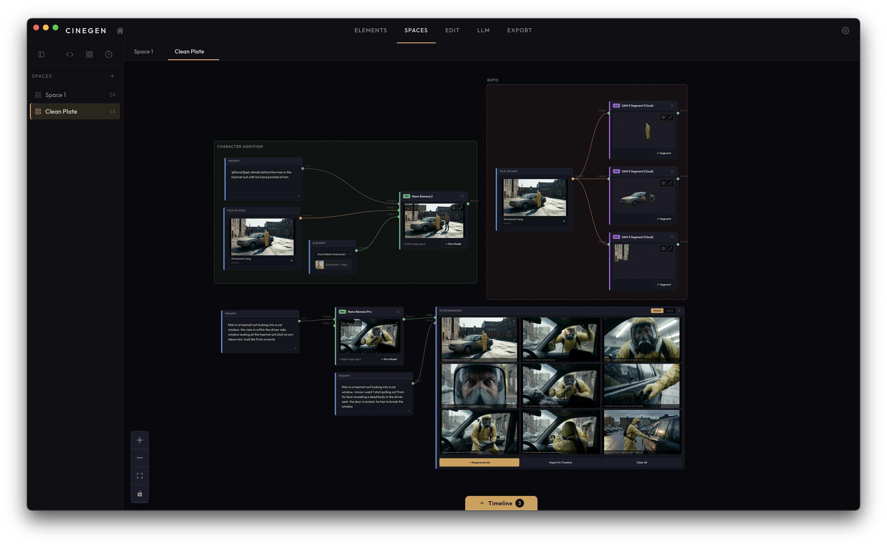
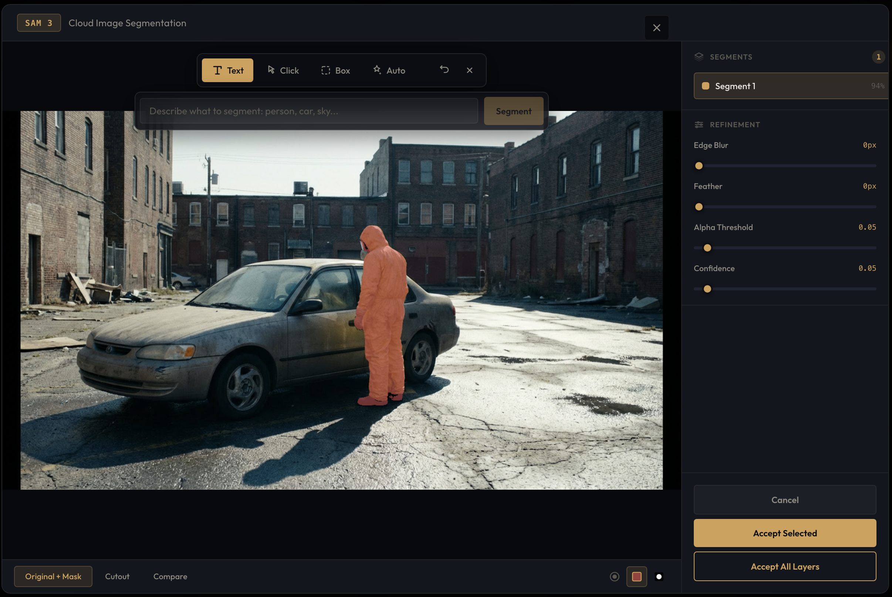
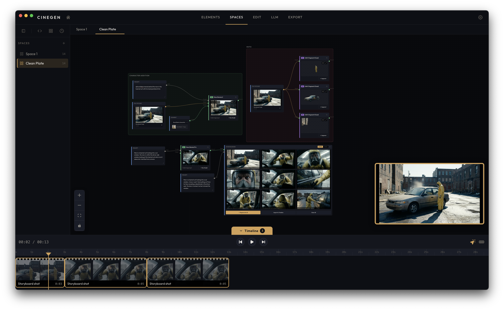
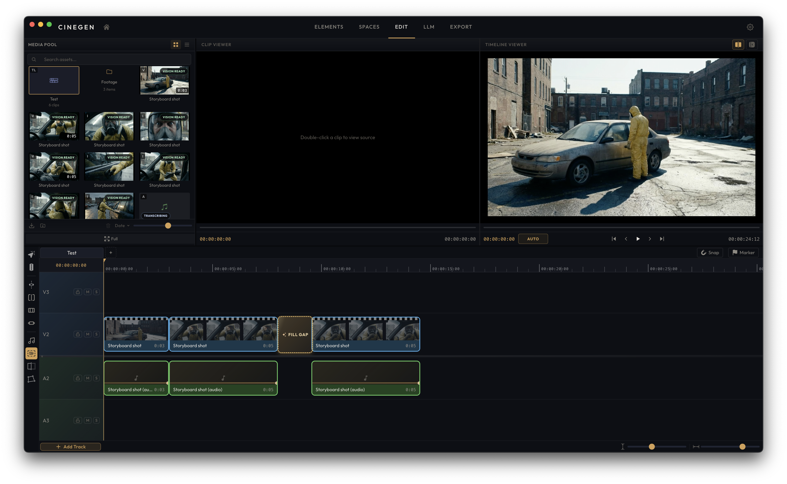
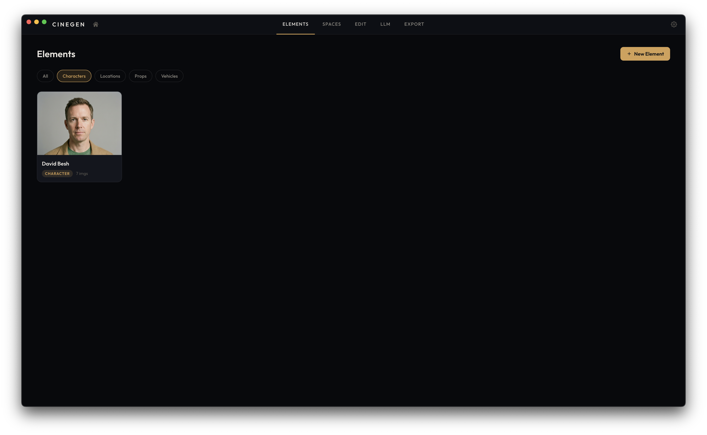
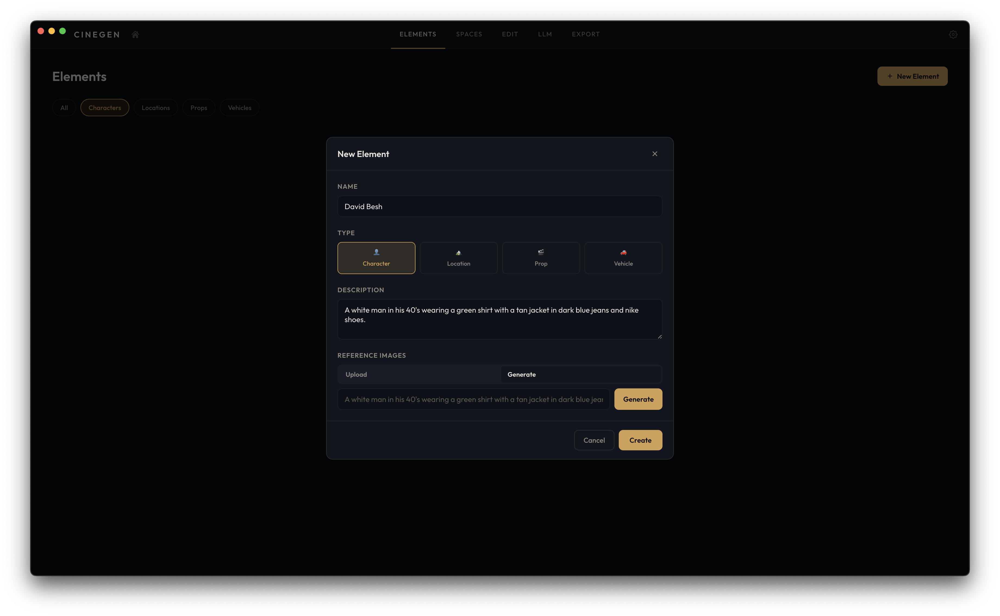
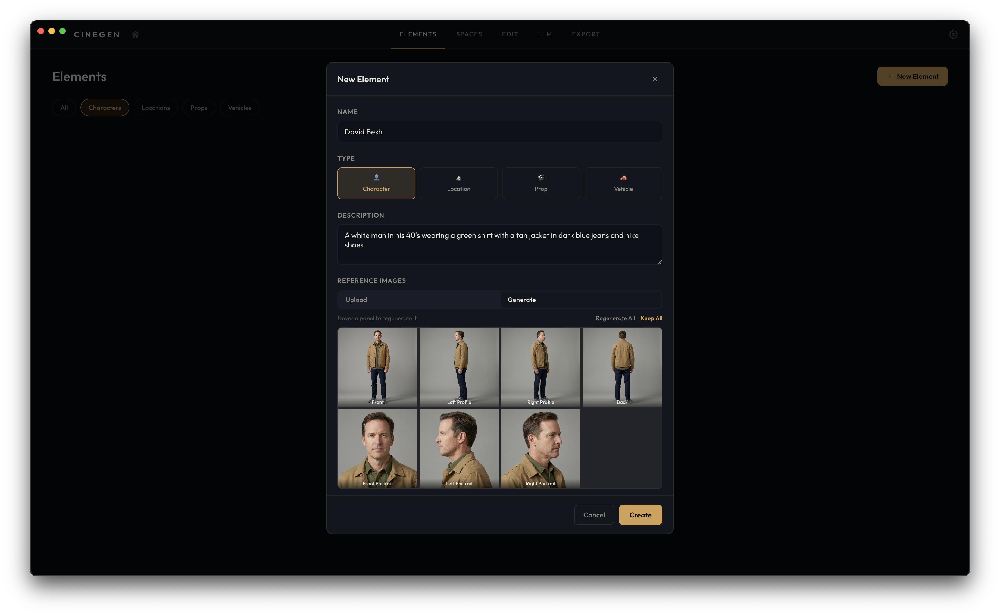
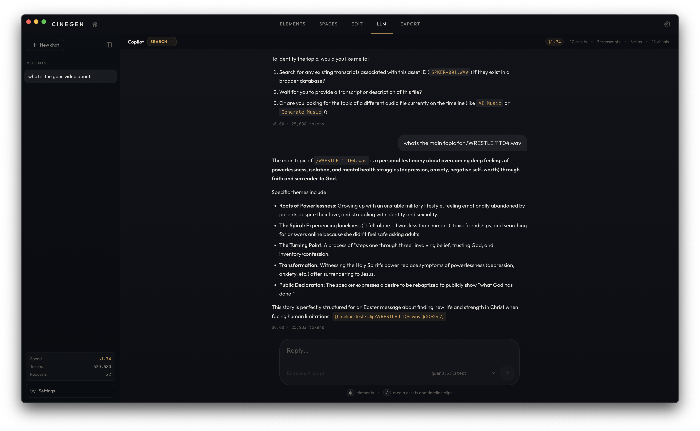

# CineGen Desktop

An AI-powered film production studio. Build generation workflows with a node editor, edit on a multi-track timeline, and export to MP4 — all from a single desktop app.


---

## Screenshots

### Project Manager



### Spaces — Node-Based Workflow Editor

Build AI generation pipelines by connecting nodes on a canvas. 50+ models across image, video, and audio.



### Spaces — SAM3 Cloud Segmentation

Segment objects from images with text, click, or box prompts. Red overlay, white-on-black, and cutout preview modes.



### Spaces — Timeline Preview

Preview and arrange generated clips directly from the workflow canvas.



### Edit — Dual Viewer

Multi-track NLE with source and timeline viewers, transport controls, and waveform display.


### Edit — Single Viewer

Focused editing with a single monitor and expanded timeline.


### Edit — Fill Gap

AI-powered gap filling generates new footage to bridge clips on the timeline.



### Elements

Reusable media libraries for characters, locations, props, and vehicles. Upload reference images to maintain visual consistency across shots.



### Element Creation

Generate new elements with AI or import from files.





### LLM Chat

Context-aware AI assistant for editorial workflow — cut planning, pacing suggestions, and scene analysis.



---

## Features

### Create — Node-Based Workflow Editor

A full-canvas node editor (React Flow) for building AI generation pipelines. Press **Space** to open the command palette.

- **50+ AI models** across image, video, audio, and image-editing categories
- **Image models** — FLUX Dev, FLUX 2 Max, Fast SDXL, SD3 Medium, Nano Banana Pro, Flux Kontext, Flux 2 Pro, GPT-4o Image
- **Video models** — Kling 3.0, LTX 2.3, Veo 3.1, Runway Gen-4, Sora 2, MiniMax, Wan 2.6 Flash
- **Audio** — ElevenLabs Music, Suno Music
- **Utility nodes** — Prompt, Shot Prompt, Element, Composition Plan, File Picker, Music Prompt, Asset Output
- **Advanced nodes** — Shot Board (batch shot variations), Storyboarder (vision-driven scene breakdowns)
- Connect nodes with edges, configure parameters in the inspector, and run the entire workflow or individual nodes

### Edit — Non-Linear Editor

A multi-track timeline with a preview monitor, transport controls, and a collapsible asset drawer.

- Drag-and-drop clips from generated assets or imported media
- Trim (in/out points), split at playhead, speed adjustment (0.1x–2x)
- Volume, opacity, and horizontal/vertical flip per clip
- Keyframe animation for opacity and volume
- Transitions (dissolve, fade to/from black)
- Track management — add, delete, reorder, mute, solo, lock
- Audio waveform visualization
- Source viewer with SAM3 masking tool
- AI-assisted editing suggestions via LLM integration

### Export

Renders the timeline to MP4 using FFmpeg.

- Quality presets: Draft (CRF 28), Standard (CRF 20), High (CRF 16)
- Customizable frame rate
- Real-time encoding progress

### Elements

Reusable media libraries for characters, locations, props, and vehicles. Upload reference images to maintain visual consistency across shots.

### LLM Chat

Context-aware AI assistant for editorial workflow — cut planning, pacing suggestions, and scene analysis.

- Cloud providers (Google Gemini, OpenAI, Anthropic via fal.ai)
- Local inference via Ollama
- Transcript-aware editing suggestions

---

## Tech Stack

| Layer | Technology |
|-------|-----------|
| Desktop | Electron 35 |
| Frontend | React 19 + TypeScript 5.9 |
| Build | Vite 6 + vite-plugin-electron |
| Node Editor | @xyflow/react (React Flow) |
| Database | SQLite via better-sqlite3 |
| Media | FFmpeg + FFprobe (static binaries) |
| AI Providers | fal.ai, kie.ai, RunPod, Ollama (local) |
| Validation | Zod |
| Testing | Vitest + Testing Library |
| Styling | Vanilla CSS (dark theme) |
| Native | Custom AVFoundation bindings (macOS) |

---

## Getting Started

### Prerequisites

- **Node.js 18+**
- **macOS 10.15+** (required for the native AVFoundation module)
- **Python 3.10+** (optional — only needed for local model runners)

### Installation

```bash
git clone https://github.com/christopherjohnogden/CineGen.git
cd CineGen

npm install
```

### Development

```bash
npm run dev
```

This builds the native AVFoundation module and starts the Vite dev server with Electron. The app opens automatically.

### Production Build

```bash
# Build the app
npm run build

# Package as DMG/ZIP (macOS)
npm run package
```

The packaged output goes to the `release/` directory.

### Commands

| Command | Description |
|---------|-------------|
| `npm run dev` | Build native module + start dev server |
| `npm run build` | Production build |
| `npm run build:native` | Rebuild the AVFoundation native module |
| `npm run preview` | Build and launch the packaged app |
| `npm run package` | Create distributable DMG/ZIP |
| `npm run screenshots` | Capture app screenshots for docs |
| `npm test` | Run tests |
| `npm run test:watch` | Run tests in watch mode |

---

## API Keys

CineGen does **not** ship with any API keys. All keys are configured in-app through the Settings page and stored locally on your machine. No keys are ever transmitted anywhere except to the provider you're calling.

| Provider | What It Enables | Where to Get a Key |
|----------|----------------|-------------------|
| [fal.ai](https://fal.ai) | Image generation (FLUX, SDXL, SD3), video generation (Kling, LTX, MiniMax, Sora), audio, cloud transcription | [fal.ai/dashboard](https://fal.ai/dashboard/keys) |
| [kie.ai](https://kie.ai) | Runway Gen-4, Veo 3.1, Flux 2 Pro, GPT-4o Image, Wan 2.6, Suno Music | [kie.ai](https://kie.ai) |
| [RunPod](https://runpod.io) | GPU cloud for custom model endpoints | [runpod.io/console](https://www.runpod.io/console/user/settings) |
| [Ollama](https://ollama.com) | Local LLM inference (no key needed — just install and run) | [ollama.com/download](https://ollama.com/download) |

Open the app, go to **Settings**, and paste your keys. You only need keys for the providers you want to use — everything else still works.

---

## Local Model Runners (Optional)

CineGen can run certain AI models locally via Python scripts. These are entirely optional and require separate setup:

| Model | Purpose | Setup Path |
|-------|---------|-----------|
| WhisperX | Fast transcription + diarization | Separate Python venv |
| Faster-Whisper | Lightweight transcription | Separate Python venv |
| SAM3 | Segment Anything — object masking | Separate Python venv |
| Layer Decompose | Scene decomposition into layers | Separate Python venv |
| LTX | Local text-to-video | Separate Python venv |

Each local model runner is an independent Python project. See the `scripts/` directory for the wrapper scripts. Local model paths are configurable in the app settings.

---

## Project Structure

```
electron/                        Electron main process
  main.ts                        App entry, window management
  preload.ts                     Context bridge API
  db/                            SQLite database layer
  ipc/                           IPC handlers (workflows, media, export, LLM, etc.)
  workers/                       Async media processing thread

src/                             React frontend
  components/
    home/                        Project manager
    workspace/                   Main workspace (tab routing, state)
    create/                      Workflow editor + node components
    edit/                        Timeline NLE + preview monitor
    export/                      Export settings + progress
    llm/                         LLM chat interface
    elements/                    Character/location/prop libraries
    settings/                    API key configuration
  lib/
    fal/                         fal.ai model registry + API client
    kie/                         kie.ai model registry
    llm/                         LLM utilities
    editor/                      Timeline operations (trim, split, duration)
    workflows/                   Workflow execution engine
    vision/                      Vision model operations
    utils/                       Helpers (ID generation, API keys, file URLs)
    validation/                  Zod schemas
  types/                         TypeScript type definitions

native/                          Native C++ modules
  avfoundation/                  macOS video acceleration (node-gyp)

scripts/                         Build scripts + Python model wrappers
vendor/                          External binaries (fpcalc)
build/                           App icons + resources
```

---

## Data Storage

Projects are stored as SQLite databases in your app data directory:

- **macOS**: `~/Library/Application Support/CineGen/projects/{projectId}/project.db`

Each project database contains tables for assets, timelines, tracks, clips, keyframes, transitions, workflow state, elements, cache metadata, and export jobs.

---

## Architecture Notes

- **IPC-first**: All heavy lifting (AI calls, FFmpeg, database) runs in the Electron main process. The renderer delegates via IPC.
- **Workflow DAG**: The node editor produces a directed acyclic graph. Workflows execute via topological sort.
- **API keys stay local**: Keys are stored in the app's local storage and only sent directly to the provider APIs.
- **Native video acceleration**: Custom AVFoundation bindings provide hardware-accelerated playback on macOS with Metal GPU support.
- **Worker threads**: Media processing (thumbnails, waveforms, proxies) runs in a dedicated worker thread to keep the UI responsive.

---

## Contributing

Contributions are welcome. Please open an issue first to discuss what you'd like to change.

1. Fork the repository
2. Create your feature branch (`git checkout -b feature/my-feature`)
3. Commit your changes
4. Push to the branch
5. Open a Pull Request

---

## License

MIT
