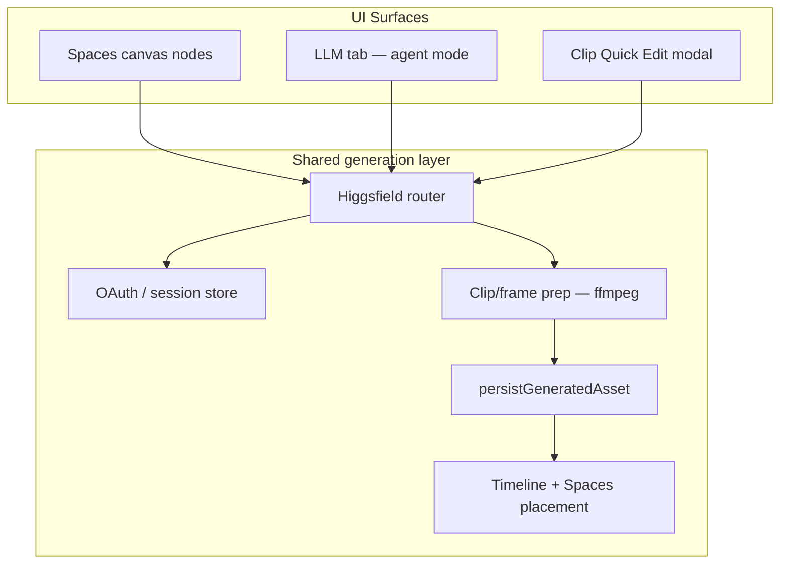

# Higgsfield Integration Plan for CineGen

> **Status:** Draft plan — no implementation yet  
> **Last updated:** May 28, 2026

A phased plan covering **Spaces nodes**, **copilot chat → timeline/spaces**, and **clip-selected quick-edit modal** — grounded in patterns CineGen already has (Fill Gap, Extend, Music Tool, skill actions, `workflow:run`).

---

## Goals

| Capability | User experience |
|------------|-----------------|
| **Spaces nodes** | Drag Higgsfield model nodes onto canvas like Seedance/Kling; wire prompts + reference images; run and preview results |
| **Copilot chat** | "Generate a rain b-roll and add it to my timeline" → generates via Higgsfield, persists, places clip |
| **Clip Quick Edit** | Select clip → shortcut → small chat modal → "clean plate of this shot" / "give him a black suit" → uses clip as reference → result lands on timeline |

---

## Architecture Overview



### Key design choice

Build one shared **Higgsfield generation service** in the Electron main process. Spaces nodes, copilot, and the quick-edit modal all call it — they differ only in how they gather inputs and where they place outputs.

### MCP vs direct API

Higgsfield MCP (`https://mcp.higgsfield.ai/mcp`) is ideal for **agent/copilot tool calling**. For Spaces nodes and the quick-edit modal (deterministic, fast, no LLM round-trip), use **Higgsfield CLI or REST API directly** from Electron — same auth, lower latency, no `--max-turns` issues. Copilot agent mode can use MCP *or* call the same shared service via internal tools.

**Recommendation:** Wrapped internal tools over raw MCP for in-app agent — avoids OAuth/token passing to CLI subprocess and gives structured placement callbacks.

---

## Phase 0 — Foundation (prerequisite for everything)

### 0.1 Higgsfield auth

- Add **Settings → Higgsfield** section (mirrors fal/kie API key pattern, but OAuth-based)
- Electron main process handles OAuth flow (browser window or system browser + callback)
- Store refresh token in OS keychain / encrypted local store — not plain `localStorage`
- Expose IPC: `higgsfield:account-status`, `higgsfield:auth-login`, `higgsfield:auth-logout`
- Surface connection status in Settings and in modals when disconnected

**Touchpoints:** `electron/ipc/`, `electron/preload.ts`, `electron.d.ts`, settings UI, `src/lib/utils/api-key.ts` (pattern reference)

### 0.2 Higgsfield client module

New Electron module (`electron/ipc/higgsfield.ts`) wrapping either:

- **Higgsfield CLI** (`higgsfield generate create --wait`) — matches existing skills, easy model discovery via `higgsfield model list`
- **REST API** — better for progress polling, cancellation, and structured errors in-app

Capabilities needed:

- Text-to-image, text-to-video
- Image-to-video (single frame or first/last)
- Image edit / inpaint-style requests (for "black suit" type edits)
- Job submit → poll → return `{ url, duration?, mediaType }`
- Cancel in-flight jobs

### 0.3 Extend model registry

In `ModelDefinition` (`src/types/workflow.ts`), add `provider: 'higgsfield'` alongside `fal | kie | runpod | pod | local`.

Add `generateWithHiggsfield()` branch in `electron/ipc/workflows.ts` (same shape as `generateWithKie` / `generateWithFal`).

### 0.4 Shared media prep pipeline

Reuse and consolidate existing patterns from:

- `electron/ipc/copilot-visual-media.ts` — ffmpeg clip segment extraction
- `src/components/edit/fill-gap-modal.tsx` / `extend-modal.tsx` — frame extraction + upload

New shared helper: **`prepareClipReference(clip, asset, options)`** → returns hosted URL(s) Higgsfield accepts:

- Single frame at playhead or clip midpoint
- Full clip segment (trim-aware, max ~90s like copilot visual refs)
- First + last frame pair for video continuation edits

Upload via existing `elements:upload` (fal CDN) or direct Higgsfield upload if their API requires it.

### 0.5 Shared placement pipeline

New internal function (renderer or IPC): **`placeGeneratedMedia(result, target)`**

Targets:

- `{ type: 'timeline', timelineId, trackId, startTime, mode: 'append' | 'replace' | 'insert_after' }`
- `{ type: 'spaces', spaceId, position, nodeType }`
- `{ type: 'asset_bin' }` — library only, no timeline placement

Uses existing:

- `ADD_ASSET` dispatch (`workspace-shell.tsx`)
- `addClipToTrack()` (`src/lib/editor/timeline-operations.ts`)
- `media:persistGeneratedAsset` (`electron/ipc/generated-asset-persist.ts`)
- Pending/generating metadata pattern (`pendingFillGap`, `pendingExtend`, `generating`) from `timeline-editor.tsx`

---

## Phase 1 — Higgsfield Nodes in Spaces

### 1.1 Model registry entries

Register Higgsfield models in `src/lib/fal/models.ts` (or new `src/lib/higgsfield/models.ts` merged into `ALL_MODELS`):

| Node type | Higgsfield model | Category | Typical use |
|-----------|------------------|----------|-------------|
| `hf-seedance-2` | Seedance 2.0 | video | Multi-shot, motion-heavy |
| `hf-kling-3` | Kling 3.0 | video | Single-plane scenes |
| `hf-veo-3` | Veo 3.1 | video | Fast batch |
| `hf-soul-v2` | Soul V2 | image | Character / UGC stills |
| `hf-gpt-image-2` | GPT Image 2 | image | General / design |
| `hf-nano-banana-2` | Nano Banana 2 | image | Fast iteration |
| `hf-cinema-studio` | Cinema Studio | video | Cinematic fidelity |

Each entry: inputs (prompt, image ref, aspect ratio, duration), `provider: 'higgsfield'`, response mapping for URL extraction.

### 1.2 Node UI

- Register in `src/lib/workflows/node-registry.ts`
- Extend `src/components/create/nodes/model-node.tsx` for `provider: 'higgsfield'` badge and auth-gated Run button
- Node palette groups under **Higgsfield** category in Create tab
- "Add to Timeline" button on completed nodes — reuse existing model-node flow

### 1.3 Execution path

```
User clicks Run on node
  → executeNode() in src/lib/workflows/execute.ts
  → workflow:run IPC with provider higgsfield
  → generateWithHiggsfield()
  → URL → node result state
  → auto-persist via workspace-shell persist effect
```

### 1.4 Spaces templates (optional, Phase 1.5)

Add Higgsfield-specific space templates to `src/lib/llm/space-templates.ts`:

- `higgsfield-storyboard` — prompt grid → Soul V2 stills
- `higgsfield-shot-list` — prompts → Seedance 2 clips

Copilot can `create_space` + `add_nodes` with these node types once registered.

---

## Phase 2 — Copilot Chat → Generate + Place

Today copilot is **chat-only** (`COPILOT_CHAT_TOOLS = ''` in `electron/ipc/claude-code.ts`). This phase adds a separate **Agent mode**.

### 2.1 Copilot modes

| Mode | Tools | Use case |
|------|-------|----------|
| **Chat** (default) | None | Q&A, skill-action buttons, timeline edits |
| **Agent** | Higgsfield + CineGen internal tools | "Generate X and put it on my timeline" |

Toggle in LLM tab: **Chat / Agent** (or auto-switch when user asks to generate).

### 2.2 New CineGen agent tools (internal)

Expose to the agent process as MCP-style tools or CLI-permitted commands:

| Tool | Purpose |
|------|---------|
| `cinegen_generate_image` | Prompt + optional ref → Higgsfield → URL |
| `cinegen_generate_video` | Prompt + optional ref → Higgsfield → URL |
| `cinegen_import_to_timeline` | URL → persist → ADD_ASSET → addClipToTrack |
| `cinegen_add_space_node` | Create Higgsfield model node with result wired |
| `cinegen_get_project_context` | Already exists via project context injection |

### 2.3 New skill actions

Extend `SkillActionStep` in `src/lib/llm/skill-actions.ts`:

```typescript
// New step types
| { type: 'import_media'; url: string; mediaType: 'image'|'video'; name?: string; target: 'timeline'|'spaces'|'bin'; ... }
| { type: 'generate_media'; prompt: string; model: string; refClipId?: string; target: ... }
```

Extend `TimelineEditOp` in `src/lib/llm/copilot-timeline-ops.ts`:

```typescript
| { op: 'add_clip'; assetId: string; trackId: string; startTime: number }
| { op: 'replace_clip'; clipId: string; assetId: string }
```

Update `COPILOT_ACTIONS_GUIDE` in `src/lib/llm/copilot-actions-guide.ts` so the agent knows when to emit these blocks vs calling tools directly.

### 2.4 Copilot flows

**Flow A — generate from scratch:**

> "Create a 5-second clip of rain on a window and add it to the end of my main timeline"

Agent → `cinegen_generate_video` → `cinegen_import_to_timeline` (append mode)

**Flow B — generate into Spaces:**

> "Add a Soul V2 node for each character in my shot list"

Agent → `add_nodes` skill action with `hf-soul-v2` nodes + pre-filled prompts

**Flow C — reference-aware:**

> "Using the clip 'Interview Take 2', make a version where the background is a clean office"

Agent → resolve clip via project context → extract frame → generate → import (insert after or new track)

---

## Phase 3 — Clip Quick Edit Modal

Highest-value UX piece. Should feel like **Extend/Fill Gap**, but prompt-driven and Higgsfield-powered.

### 3.1 UX spec

**Trigger:**

- User selects **one clip** on timeline (reuse `selectedClipIds` from `edit-tab.tsx`)
- Keyboard shortcut: **`Cmd+Shift+G`** (G for Generate) — confirm no conflict with existing shortcuts in `timeline-editor.tsx`
- Right-click context menu → **"Quick Edit with AI…"**
- Source viewer when clip is loaded

**Modal:**

- Compact overlay (like `fill-gap-modal.tsx` / `music-generation-popup.tsx`), not full LLM tab
- Shows: clip thumbnail (frame at playhead), clip name, duration, track
- Single prompt input with placeholder examples:
  - *"Create a clean plate of this shot"*
  - *"Make the person wear a black suit"*
  - *"Remove the logo from the shirt"*
  - *"Extend this 3 more seconds with the same motion"*
- Optional: model picker (collapsed "Advanced") — default auto-routed
- **Generate** button + progress states (extracting → uploading → generating → placing)
- Escape to close; Enter to submit

**Output placement (defaults):**

| Request type | Auto-detected intent | Default placement |
|--------------|---------------------|-------------------|
| Clean plate / background | Image edit | New clip on **track above** (overlay) or new asset in bin |
| Wardrobe / object change | Video edit / img2vid | **Insert after** selected clip on same track |
| Style change | Image or video | Insert after |
| Extend / continue | Video continuation | Extend pattern — adjacent append |

User can override in Advanced: **Replace clip** / **Insert after** / **New track** / **Asset bin only**.

Non-destructive default: **insert after** selected clip (matches Extend tool philosophy).

### 3.2 Intent routing (prompt → model + mode)

Lightweight classifier (rules first, optional small LLM call later):

| Intent keywords | Higgsfield path | Input media |
|-----------------|-----------------|-------------|
| "clean plate", "remove background", "empty room" | Image edit / inpaint | Single frame |
| "black suit", "change clothes", "replace X with Y" | Video edit or img2vid | Clip segment or key frame |
| "extend", "continue", "more of this" | Seedance 2 / Kling i2v | Last frame |
| "stylize", "make it look like" | Soul / GPT Image 2 | Frame |
| Ambiguous | Seedance 2 video with ref | Clip segment |

No need to expose routing to the user initially — show "Auto" in Advanced.

### 3.3 Technical flow

```
1. User selects clip, hits Cmd+Shift+G
2. Modal opens with clip context:
   - clip.id, asset.id, trimStart/trimEnd, playhead time
3. User types prompt, clicks Generate
4. Media prep:
   - Extract frame(s) or clip segment via ffmpeg (copilot-visual-media pattern)
   - Upload to hosted URL
5. Higgsfield generation:
   - higgsfield:generate IPC with { prompt, model, refUrls, mediaType }
   - Show progress / allow cancel
6. Persist + place:
   - persistGeneratedAsset → local project file
   - ADD_ASSET
   - addClipToTrack (insert after selected clip.startTime + effectiveDuration)
   - Optional: link metadata { sourceClipId, quickEditPrompt, higgsfieldJobId }
7. Timeline shows new clip with generating → done states (reuse pendingExtend pattern)
8. Modal closes or offers "Generate another variation"
```

### 3.4 Precedent in codebase

| Existing | Reuse for Quick Edit |
|----------|---------------------|
| `FillGapModal` | Modal shell, frame extraction, upload, generation handoff |
| `ExtendModal` | Model routing, duration snap, `onStartGeneration` promise pattern |
| `music-generation-popup.tsx` | Popup UX, video context analysis |
| `timeline-editor.tsx` `handleExtendStartGeneration` | Pending clip state, replace-on-complete |
| `copilot-visual-media.ts` | ffmpeg clip segment extraction |
| `edit-tab.tsx` `selectedClip` / `selectedClipAsset` | Selection context |

### 3.5 Edge cases

- **Multi-select clips:** Disable shortcut; show toast "Select one clip"
- **Audio-only clip:** Disable; show "Quick Edit requires video or image"
- **Proxy vs full-res:** Prefer full-res local path via `resolveExistingLocalPath`
- **Long clips:** Extract segment capped at ~15–30s for edit requests; full clip for "extend"
- **Auth expired:** Inline "Connect Higgsfield" button in modal
- **Generation failure:** Keep modal open, show error, preserve prompt
- **Undo:** Standard undo stack should capture ADD_ASSET + SET_TIMELINE as one action

---

## Phase 4 — Polish & Cross-Cutting Concerns

### 4.1 Settings & billing

- Higgsfield account link / credit balance display (if API exposes it)
- Per-model cost hints in node UI and quick-edit Advanced panel
- Fallback model if primary fails (e.g. Kling → Seedance)

### 4.2 Project metadata

Track provenance on generated assets:

```typescript
metadata: {
  higgsfieldJobId?: string;
  higgsfieldModel?: string;
  sourceClipId?: string;
  quickEditPrompt?: string;
  generatedVia: 'spaces' | 'copilot' | 'quick-edit';
}
```

Useful for re-generation, debugging, and future "regenerate with same settings."

### 4.3 Copilot project context

Extend `buildProjectContext()` in `src/lib/llm/project-context.ts` to mention:

- Higgsfield connection status
- Available Higgsfield node types
- Quick Edit capability ("user can select a clip and use Cmd+Shift+G")

### 4.4 Testing plan

| Area | Tests |
|------|-------|
| Higgsfield client | Mock API responses; auth token refresh |
| Model registry | Provider routing in `workflow:run` |
| Media prep | Frame extraction from trimmed clips |
| Placement | append/replace/insert_after timeline ops |
| Quick Edit modal | Intent routing unit tests |
| Skill actions | `import_media`, `add_clip` execution |
| E2E | Select clip → shortcut → generate → clip appears (with mocked Higgsfield) |

---

## Recommended Build Order

```
Phase 0  Foundation          ~1–2 weeks   (blocks everything)
Phase 3  Clip Quick Edit     ~1 week      (highest user value, validates Higgsfield pipeline)
Phase 1  Spaces nodes        ~1 week      (reuses same generate + persist layer)
Phase 2  Copilot agent       ~1–2 weeks   (skill actions + agent mode)
Phase 4  Polish              ongoing
```

**Why Quick Edit before Spaces nodes:** Exercises the full pipeline (auth → media prep → generate → timeline placement) in one focused UX. Spaces nodes then become mostly registry + UI wiring.

---

## Open Decisions

1. **Shortcut key** — `Cmd+Shift+G` vs `H` vs something else (check conflicts with existing edit shortcuts in `timeline-editor.tsx`)
2. **Default placement for edits** — insert after vs replace vs new track above (recommend: insert after, with Advanced override)
3. **Clean plate output** — still image on overlay track vs full video with static BG (recommend: image on track above for comp flexibility)
4. **Agent tool strategy** — raw Higgsfield MCP in spawned CLI vs custom CineGen-wrapped tools (recommend: wrapped tools for reliability)
5. **Higgsfield vs existing fal/kie models** — same models exist on both providers; decide whether Higgsfield nodes are additive or preferred when connected

---

## Deliverables Summary

When complete, users get:

- **Spaces:** Higgsfield model nodes on canvas, wired like any other model, with Add to Timeline
- **Copilot:** Agent mode that generates from chat and places on timeline or Spaces via skill actions / tools
- **Quick Edit:** Select clip → shortcut → "clean plate" / "black suit" → Higgsfield does the work → new clip on timeline

All three share one Higgsfield service, one auth flow, and one placement pipeline — no duplicated generation logic.

---

## Related Files

| Area | Path |
|------|------|
| Model registry | `src/lib/fal/models.ts`, `src/types/workflow.ts` |
| Workflow execution | `electron/ipc/workflows.ts`, `src/lib/workflows/execute.ts` |
| Copilot skill actions | `src/lib/llm/skill-actions.ts`, `src/lib/llm/copilot-actions-guide.ts` |
| Timeline placement | `src/lib/editor/timeline-operations.ts`, `src/components/workspace/workspace-shell.tsx` |
| Clip-aware modals (precedent) | `src/components/edit/fill-gap-modal.tsx`, `extend-modal.tsx`, `music-generation-popup.tsx` |
| Visual ref extraction | `electron/ipc/copilot-visual-media.ts`, `src/lib/llm/copilot-visual-refs.ts` |
| Asset persistence | `electron/ipc/generated-asset-persist.ts` |
| Copilot (tools disabled today) | `electron/ipc/claude-code.ts` |
| Higgsfield MCP (external) | `https://mcp.higgsfield.ai/mcp` |
